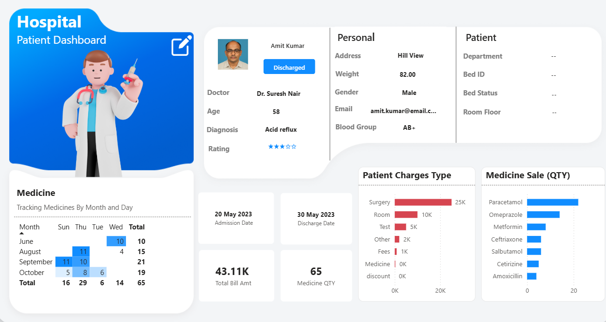
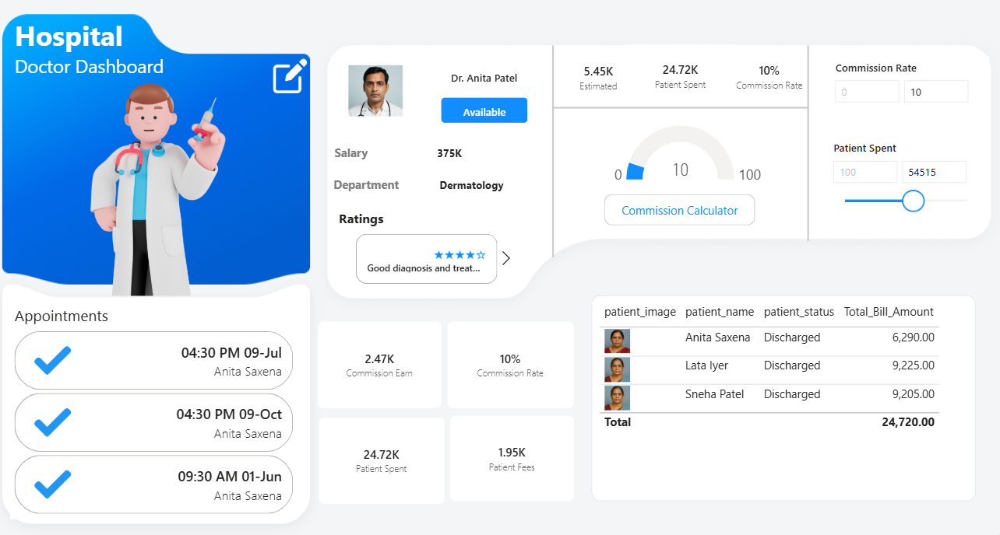
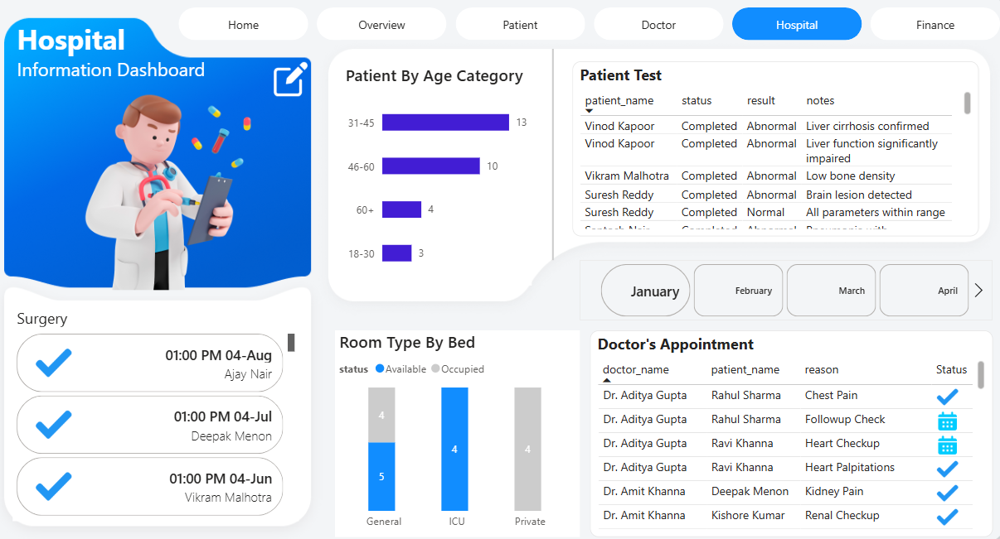

# 🏥 Power BI Hospital Management Dashboard

> An end-to-end, multi-page Business Intelligence solution that transforms raw hospital data into actionable insights — covering patient flow, doctor performance, finance, inventory, and real-time resource monitoring.

<br>

[](https://powerbi.microsoft.com/)
[](https://www.mysql.com/)
[](https://www.figma.com/)
[](https://www.microsoft.com/en-us/microsoft-365/excel)
[]()

<br>

---

## 📌 Project Overview

This project is a **comprehensive, production-grade Hospital Management Dashboard** built entirely in Power BI. It was developed as an end-to-end portfolio project across 5 build phases — from raw data ingestion to a fully interactive, app-like analytics tool.

The dashboard enables hospital administrators to:
- Monitor **patient admissions, discharges, and surgery schedules** in real time
- Analyze **individual doctor performance** and simulate commission earnings
- Track **inventory levels** for medicines and identify low-stock risks
- Oversee **bed availability** across ICU, General, and Private wards
- Review **revenue, billing totals, and operational expenses** on one screen

<br>

---

## 🖼️ Dashboard Preview

| Home Page | Overview |
|-----------|----------|
|  |  |

| Patient Page | Doctor Page |
|-------------|-------------|
|  |  |

| Hospital Operations | Finance & Inventory |
|--------------------|---------------------|
|  |  |


<br>

---

## 🗂️ Repository Structure

```
PowerBI-Hospital-Management-Dashboard/
│
├── 📊 dashboard/
│   ├── Hospital_Management_Dashboard.pbix     ← Main Power BI file
│   └── Hospital_Management_Dashboard.pdf      ← Exported PDF (view without Power BI)
│
├── 📁 Data_Sources/
│   ├── raw/                                   ← 16 source Excel sheets
│   │   ├── patients.xlsx
│   │   ├── doctors.xlsx
│   │   ├── staff.xlsx
│   │   ├── appointments.xlsx
│   │   ├── medicine_inventory.xlsx
│   │   ├── beds.xlsx
│   │   └── ... (remaining sheets)
│   ├── sql/                                   ← MySQL scripts
│   │   ├── hospital_db.sql
│   │   ├── views.sql
│   
├── 🎨 Screenshots/                      ← Dashboard page screenshots
│   ├── home_page.png                              
│   ├── overview_page.png
│   ├── patient_page.png
│   ├── doctor_page.png
│   ├── hospital_ops_page.png
│   └── finance_page.png
│     
│
├── 📄 docs/
│   ├── data_dictionary.md                     ← Column definitions for all tables
│   ├── dax_measures.md                        ← All custom DAX formulas documented
│   ├── data_model.png                         ← Star schema relationship diagram
│   └── setup_guide.md                         ← Step-by-step setup instructions
│
├── README.md
├── CHANGELOG.md
└── .gitignore
```

<br>

---

## 🛠️ Tech Stack

| Tool | Purpose |
|------|---------|
| **Power BI Desktop** | Dashboard development, data modeling, visualization |
| **DAX** | Custom measures — KPIs, commission logic, percentage calculations |
| **Power Query (M)** | Data transformation, type casting, column renaming |
| **MySQL** | Relational database backend; SQL JOINs for bed/room data |
| **Excel (.xlsx)** | Primary data source — 16 sheets covering all hospital domains |
| **Figma** | UI/UX design — custom canvas backgrounds, vector icons, layout mockups |

<br>

---

## 📊 Dashboard Pages

### 1. 🏠 Home Page
A professional landing page with large navigation buttons that route users to each module. Features branded doctor imagery and serves as the entry point for all stakeholders.

### 2. 📈 Overview
High-level snapshot of hospital performance:
- Total patients, doctors, and staff counts
- Admitted vs. Discharged patient ratio (donut chart — 73% discharged / 27% admitted)
- Patient discharge trend by date (line chart with chronological Month-Year sorting)
- Bed availability status and medicine stock vs. sold ratio

### 3. 🧑‍⚕️ Patient Management
Deep-dive into individual patient profiles:
- Dynamic patient images and personal medical records
- Admission and discharge dates, assigned departments
- Interactive **Bookmark-based filter toggles** for a clean, app-like UX

### 4. 👨‍⚕️ Doctor Performance
Individual doctor analytics with financial simulation:
- Appointment cards with status icons (✔ Completed / 📅 Scheduled)
- Patient feedback and star ratings in a scrollable card layout
- **Commission Calculator** — adjustable sliders for Patient Spend and Commission Rate % to simulate real-time earnings
- Gauge chart showing commission achievement against target

### 5. 🏨 Hospital Operations
Facility-wide operational visibility:
- Surgery schedule with time/date and completion status
- Patient age distribution using `SWITCH(TRUE())` DAX buckets (e.g., 18–30, 31–45)
- Live bed occupancy by ward (ICU / General / Private)
- Staff attendance tracker using a custom calendar layout

### 6. 💰 Finance & Inventory
Revenue and supply chain analytics:
- Monthly medicine sales with **conditional formatting** (red highlight if > 800 units)
- Total Stock vs. Remaining Stock comparison by medicine
- Supplier-level medicine quantity breakdown
- KPIs: Total Bills Generated, Total Bill Amount, Total Doctor Salaries, Total Medicines Sold

<br>

---

## ⚙️ Key Technical Implementations

### Data Modeling
- **Star Schema** architecture connecting patient, doctor, appointment, and inventory tables
- **Bridge table** created to resolve Many-to-Many staff-department relationships
- Cross-filter direction set to **"Both"** for correct slicer propagation across all visuals

### DAX Highlights

```dax
-- Discharge percentage (ignores active slicers using ALL)
Discharge % =
DIVIDE(
    CALCULATE(COUNTROWS(Patients), Patients[Status] = "Discharged"),
    CALCULATE(COUNTROWS(Patients), ALL(Patients))
)

-- Age group segmentation using SWITCH
Age Group =
SWITCH(TRUE(),
    Patients[Age] <= 17, "Under 18",
    Patients[Age] <= 30, "18–30",
    Patients[Age] <= 45, "31–45",
    Patients[Age] <= 60, "46–60",
    "60+"
)

-- Commission calculator with numeric range parameter
Estimated Commission =
VAR PatientSpend = [Total Bill Amount] - [Total Discount]
VAR CommissionRate = SELECTEDVALUE(CommissionParam[CommissionParam Value])
RETURN PatientSpend * CommissionRate
```

### Power Query Fixes
- Corrected `Stock Quantity` column imported as **text** → converted to **Whole Number** to enable SUM aggregation
- Fixed `Surgery Date` column formatting for correct time display in visuals
- Renamed and cleaned all 16 Excel file imports for model consistency

### SQL (MySQL)
```sql
-- Bed availability using JOIN across beds and rooms tables
SELECT
    r.RoomType,
    COUNT(b.BedID) AS TotalBeds,
    SUM(CASE WHEN b.Status = 'Available' THEN 1 ELSE 0 END) AS AvailableBeds,
    SUM(CASE WHEN b.Status = 'Occupied' THEN 1 ELSE 0 END) AS OccupiedBeds
FROM Beds b
JOIN Rooms r ON b.RoomID = r.RoomID
GROUP BY r.RoomType;
```

<br>

---

## 🚀 Getting Started

### Prerequisites
- [Power BI Desktop](https://powerbi.microsoft.com/en-us/desktop/) (free)
- [MySQL Server](https://dev.mysql.com/downloads/mysql/) (optional — sample Excel data included)
- Microsoft Excel (to view raw data files)

### Setup Instructions

**Option A — Quick Start (Excel only)**
1. Clone this repository
   ```bash
   git clone https://github.com/your-username/PowerBI-Hospital-Management-Dashboard.git
   ```
2. Open `dashboard/Hospital_Management_Dashboard.pbix` in Power BI Desktop
3. When prompted, update the data source path to point to your local `/data/raw/` folder
4. Click **Refresh** — the dashboard will load with sample data

**Option B — Full MySQL Setup**
1. Run `data/sql/create_tables.sql` to create the database schema
2. Import the Excel files into MySQL using the provided scripts
3. In Power BI Desktop → **Transform Data** → update the MySQL server connection string
4. Refresh and explore

> 📄 For detailed setup instructions, see [`docs/setup_guide.md`](docs/setup_guide.md)

<br>

---

## 📁 Data Sources

The project uses **16 Excel sheets** and a **MySQL database** covering:

| Domain | Tables |
|--------|--------|
| Patients | Patient demographics, admission records, discharge status |
| Doctors | Doctor profiles, departments, salaries, qualifications |
| Appointments | Appointment IDs, dates, status, doctor-patient mapping |
| Surgery | Surgery schedules, types, completion status |
| Staff | Staff IDs, departments, attendance records |
| Inventory | Medicine names, suppliers, stock levels, sales quantities |
| Beds & Rooms | Bed IDs, room types (ICU/General/Private), occupancy status |
| Finance | Bills generated, bill amounts, discounts, payment status |

> ⚠️ All data in this repository is **fictional and anonymized** for portfolio purposes only.

<br>

---

## 💡 What I Learned

- How to structure a **multi-source data model** efficiently using Star Schema principles
- Writing **complex DAX measures** using `ALL()`, `SWITCH(TRUE())`, `VAR/RETURN`, and `DIVIDE()`
- Resolving **Many-to-Many relationship issues** in Power BI using bridge tables
- Using **Power Query** to fix dirty data before it reaches the visualization layer
- Designing a **professional UI** in Figma and exporting canvas backgrounds into Power BI
- Connecting **MySQL to Power BI** and using SQL queries for performance-optimized data pulls
- Building **interactive UX** using Bookmarks, Selection Panes, and Page Navigation actions

<br>

---

## 🔮 Future Improvements

- [ ] Implement **Row-Level Security (RLS)** to restrict views by role (Finance vs. Medical Staff)
- [ ] Add **scheduled data refresh** via Power BI Service
- [ ] Integrate a **forecasting visual** for patient admissions using Power BI's analytics pane
- [ ] Publish to **Power BI Service** with a public shareable link
- [ ] Add a **Python/R visual** for advanced statistical analysis of patient trends

<br>

---

## 📬 Contact

**Your Name**
📧 karansalunkhe804@gmail.com
🔗 [LinkedIn](https://www.linkedin.com/in/karansalunkhe804/)
🐙 [GitHub](https://github.com/karansalunkhe21)

> *This project was built as part of a hands-on Power BI learning series. If you found this helpful or have suggestions, feel free to open an issue or connect on LinkedIn!*

<br>

---

## ⭐ If this project helped you, please give it a star!

<!-- Shields.io badges for GitHub stats -->


